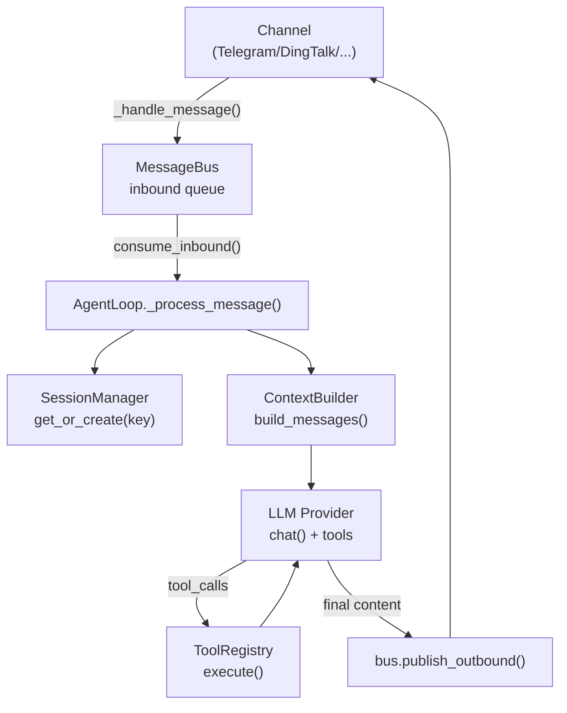
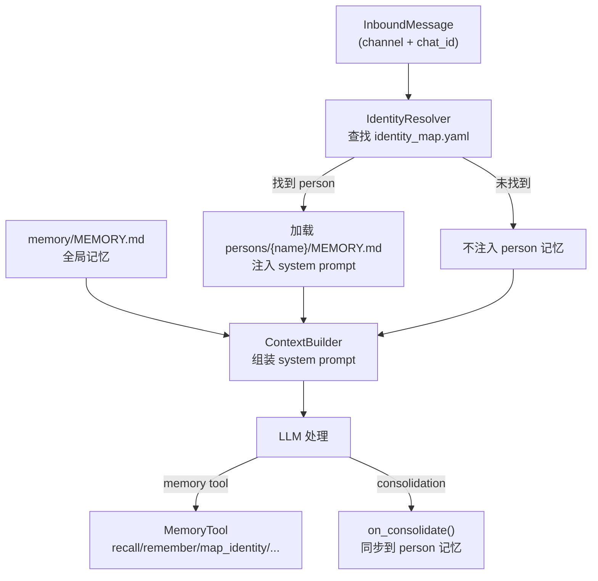

# nanobot-ava 项目总图

## 1. 架构分层

```
nanobot/
├── agent/                        # 核心 Agent 逻辑 (LLM ↔ tools)
│   ├── loop.py                   # Agent 主循环
│   ├── context.py                # System Prompt 构建器
│   ├── memory.py                 # 全局持久化记忆
│   ├── categorized_memory.py     # 分类记忆 (IdentityResolver + CategorizedMemoryStore)
│   ├── skills.py                 # Skills 加载器
│   ├── subagent.py               # 后台子任务
│   └── tools/                    # 内置工具
│       ├── memory_tool.py        # 分类记忆工具 (MemoryTool)
│       └── ...
├── channels/        # 聊天渠道集成
├── bus/             # 消息路由总线
├── cron/            # 定时任务
├── heartbeat/       # 心跳
├── providers/       # LLM 提供者
├── session/         # 会话管理
├── config/          # 配置
├── cli/             # CLI 命令
├── utils/           # 工具函数
├── skills/          # 内置 skills
└── templates/       # Workspace 模板
```

## 2. 核心模块签名

### AgentLoop (`nanobot/agent/loop.py`)

```python
class AgentLoop:
    def __init__(self, bus, provider, workspace, model, max_iterations, temperature,
                 max_tokens, memory_window, brave_api_key, exec_config, cron_service,
                 restrict_to_workspace, session_manager, mcp_servers, channels_config)
    async def run()
    async def _process_message(msg: InboundMessage, ...)
    async def _run_agent_loop(initial_messages, on_progress)
    async def process_direct(content, session_key, channel, chat_id, on_progress)
    def _set_tool_context(channel, chat_id, message_id)
```

### ContextBuilder (`nanobot/agent/context.py`)

```python
class ContextBuilder:
    BOOTSTRAP_FILES = ["AGENTS.md", "SOUL.md", "USER.md", "TOOLS.md", "IDENTITY.md"]
    def __init__(self, workspace: Path, categorized_memory: CategorizedMemoryStore | None = None)
    def build_system_prompt(self, skill_names=None, channel=None, chat_id=None) -> str
    def build_messages(self, history, current_message, skill_names, media, channel, chat_id) -> list[dict]
```

### MemoryStore (`nanobot/agent/memory.py`)

```python
class MemoryStore:
    def __init__(self, workspace: Path)
    def read_long_term(self) -> str
    def write_long_term(self, content: str) -> None
    def append_history(self, entry: str) -> None
    def get_memory_context(self) -> str
    def _parse_session_key(key: str) -> tuple[str | None, str | None]  # static
    async def consolidate(self, session, provider, model, archive_all, memory_window, categorized_store=None) -> bool
```

### CategorizedMemoryStore (`nanobot/agent/categorized_memory.py`)

```python
class IdentityResolver:
    def __init__(self, workspace: Path)
    def resolve(self, channel: str, chat_id: str) -> str | None
    def add_mapping(self, person_name, channel, chat_id, display_name=None) -> None
    def list_persons(self) -> dict[str, Any]
    def _match_id(entry_id: str | list, chat_id: str) -> bool  # static

class CategorizedMemoryStore:
    def __init__(self, workspace: Path)
    def resolve_person(self, channel, chat_id) -> str | None
    def get_person_memory(self, person_name) -> str
    def get_source_memory(self, channel, chat_id) -> str
    def write_person_memory(self, person_name, content) -> None
    def append_person_history(self, person_name, entry) -> None
    def write_source_note(self, channel, chat_id, content) -> None
    def get_combined_context(self, channel, chat_id) -> str
    def add_identity(self, person_name, channel, chat_id, display_name=None) -> None
    def list_persons(self) -> list[dict]
    def on_consolidate(self, channel, chat_id, history_entry, memory_facts) -> None
```

### MemoryTool (`nanobot/agent/tools/memory_tool.py`)

```python
class MemoryTool(Tool):
    def __init__(self, store: CategorizedMemoryStore)
    def set_context(self, channel, chat_id) -> None
    # Actions: recall, remember, list_persons, map_identity, search_history
    async def execute(self, action: str, **kwargs) -> str
```

### Tool 基类 (`nanobot/agent/tools/base.py`)

```python
class Tool(ABC):
    @property name, description, parameters
    async def execute(self, **kwargs) -> str
    def validate_params(self, params) -> list[str]
    def to_schema(self) -> dict
```

### ToolRegistry (`nanobot/agent/tools/registry.py`)

```python
class ToolRegistry:
    def register(self, tool: Tool)
    def unregister(self, name: str)
    def get(self, name: str) -> Tool | None
    def get_definitions(self) -> list[dict]
    async def execute(self, name: str, params: dict) -> str
```

## 3. 消息流



## 4. Session Key 格式

- 默认: `{channel}:{chat_id}` (e.g. `telegram:8281248569`)
- Slack: `slack:{chat_id}:{thread_ts}`
- Cron: `cron:{job_id}`
- CLI: `cli:direct`

## 5. 记忆系统

### 5.1 全局记忆
- `workspace/memory/MEMORY.md` → 长期记忆 (事实摘要，所有用户共享)
- `workspace/memory/HISTORY.md` → 可搜索日志
- 触发: `unconsolidated >= memory_window` 时 LLM 自动 consolidate

### 5.2 分类记忆 (CategorizedMemory)
- **身份映射**: `workspace/memory/identity_map.yaml` (channel:id[] → person)
- **Person 记忆**: `workspace/memory/persons/<name>/MEMORY.md` (跨渠道聚合)
- **Person 历史**: `workspace/memory/persons/<name>/HISTORY.md`
- **Source 记忆**: `workspace/memory/persons/<name>/sources/<channel>_<id>.md` (渠道特定)
- **匿名**: `workspace/memory/persons/anonymous/sources/` (未映射 ID)
- **模型操作规约（精简）**: `workspace/TOOLS.md` → `Categorized Memory`
- **模板（详细结构/人类参考）**: `workspace/memory/CATEGORIZED_MEMORY_TEMPLATE.md`

### 5.3 identity_map.yaml 格式
```yaml
persons:
  <person_key>:
    display_name: "显示名称"
    ids:
      - channel: telegram
        id: ["12345678", "87654321"]   # 支持同渠道多账号
      - channel: cli
        id: ["direct"]
```

### 5.4 记忆注入流程


## 6. 工具上下文注入

- `_set_tool_context(channel, chat_id, message_id)` 在 `_process_message()` 中调用
- `MessageTool.set_context(channel, chat_id, message_id)`
- `SpawnTool.set_context(channel, chat_id)`
- `CronTool.set_context(channel, chat_id)`
- `MemoryTool.set_context(channel, chat_id)`

## 7. Workspace 布局

```
workspace/
├── AGENTS.md / SOUL.md / USER.md / TOOLS.md / IDENTITY.md
├── HEARTBEAT.md
├── memory/
│   ├── MEMORY.md                          # 全局记忆
│   ├── HISTORY.md                         # 全局历史
│   ├── identity_map.yaml                  # 身份映射 (id 支持数组)
│   ├── CATEGORIZED_MEMORY_TEMPLATE.md     # 分类记忆模板
│   └── persons/                           # 按自然人分类
│       ├── <person>/
│       │   ├── MEMORY.md                  # Person 级记忆
│       │   ├── HISTORY.md                 # Person 级历史
│       │   └── sources/                   # 按渠道细分
│       │       ├── telegram_<id>.md
│       │       └── cli_direct.md
│       └── anonymous/
│           └── sources/
├── sessions/
│   └── {channel}_{chat_id}.jsonl
└── skills/
    └── {skill}/SKILL.md
```
